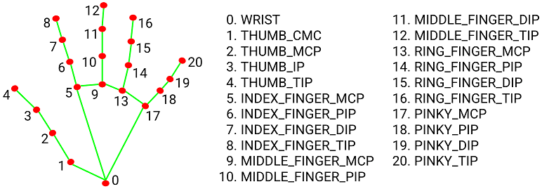
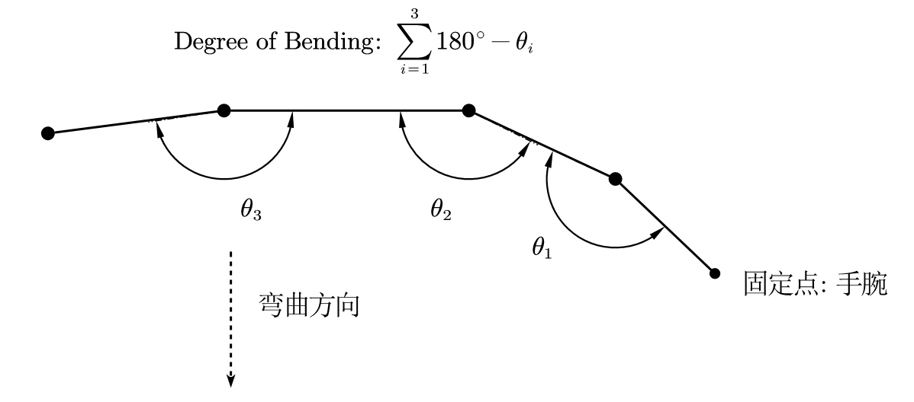
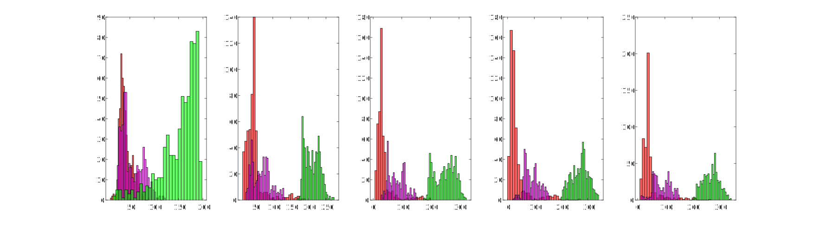

Part1: Pose
===========

**theta1**

```yaml
0: [0, 30]
1: [30, 70]
2: [70, 140]
3: [140, ~
```

**theta2**

```
0: [0, 110]
1: [110, ~]
```

**动作组合:**

```
手臂向前伸直: [2, 1]
手臂向前伸直 && 手肘向上90°: [2, 0]
手臂向前伸直90°上下舞动: [2, 1] 与 [1, 1] 交替
```


# Part2: Hand

**想法: ** 考虑两种方法

- 第一种是人为提取额特征并对特征进行处理
- 第二种是人为提取粗略的特征，然后使用机器学习算法进行分类

**第一种: ** 



> NOTE **特征量的目的:** 手指就两个动作，完全弯曲和完全伸直，所以对于单根手指几乎只用考虑三种状态 {完全收缩，完全伸直，中间态}，我们要做的就是定义一个特征量来将这三种状态加一区分
>
> TODO 如果**摄像头过远，则可能识别效果变差**，可以首先使用`Pose`模型处理得到手部的`ROI`，然后使用`Hand`对该`ROI`进行推理；还可以进一步提高摄像头的分辨率来降低图像失真。

特征1: 衡量手指的弯曲程度
-------------------------





目测观察区间

```
[60, 100]
[60, 176]大指姆和小指母翘起，其余三指并拢
[50, 180]
[55, 200]
[53, 208]
```

对应动作`code`

```
五指并拢: [0, 0, 0, 0, 0]
大拇指竖起: [0, 2, 2, 2, 2]
大指姆和小指母翘起，其余三指并拢: [0, 2, 2, 2, 0]
二指并拢: [2, 0, 0, 2, 2]
单手握拳: [2, 2, 2, 2, 2]
```

Part2: 综合 Hands 和 Pose
=========================

整理(2022年10月9日21:45:21)
---------------------------

优化空间

- [ ] 单独模型的识别率: 通过优化 时间、角度参数
  - 不断单独调试即可
- [ ] 速度: 使用GPU

TODO

- [x] 整理所有动作、动作代码、返回结果数据的格式
- [ ] 多人时，仅追踪一人
- [ ] 搞清楚3D坐标系
- [x] UDP通信

May 手掌太远解决方案

- 先识别出手指关节点，然后设置ROI，随后对该ROi进行推理

服务器端
========

使用udp，满足查询式返回，即仅查询才返回

> 23) 系统采用网络通讯（UDP 协议），按照查询（主控）/应答（设备）；  -> 设置一个服务器端
> 24) 设备固定 IP 地址和端口号，主控主动连接； -> 固定 (IP, port)
> 25) 通讯内容包括控制和数据流； -> 
>     - 输入控制：系统启动、待机，状态信息，运行日志等；
>     - 返回数据为数据流：动作和语音指令，按照时间序列方式传递；

TODO: 

- [x] 集成 UDP 服务器
- [x] 明确命令 及对应的操作
- [x] 修改整理动作
- [x] 明确返回数据的格式 JSON 编码
- [ ] 3D坐标

